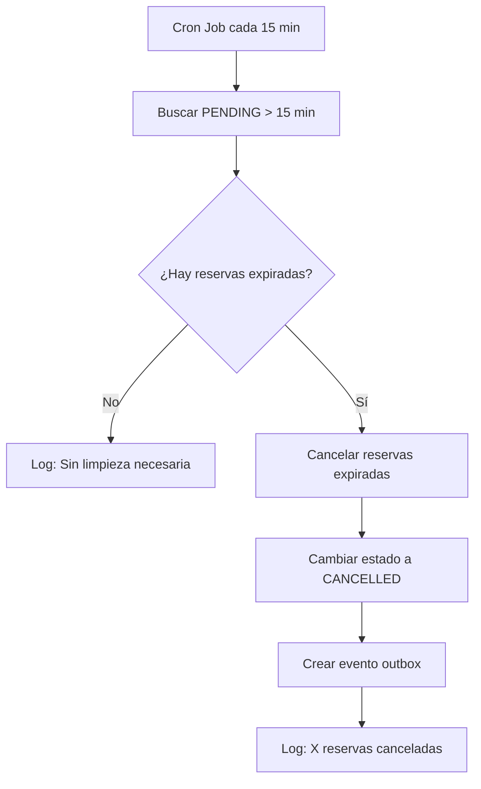
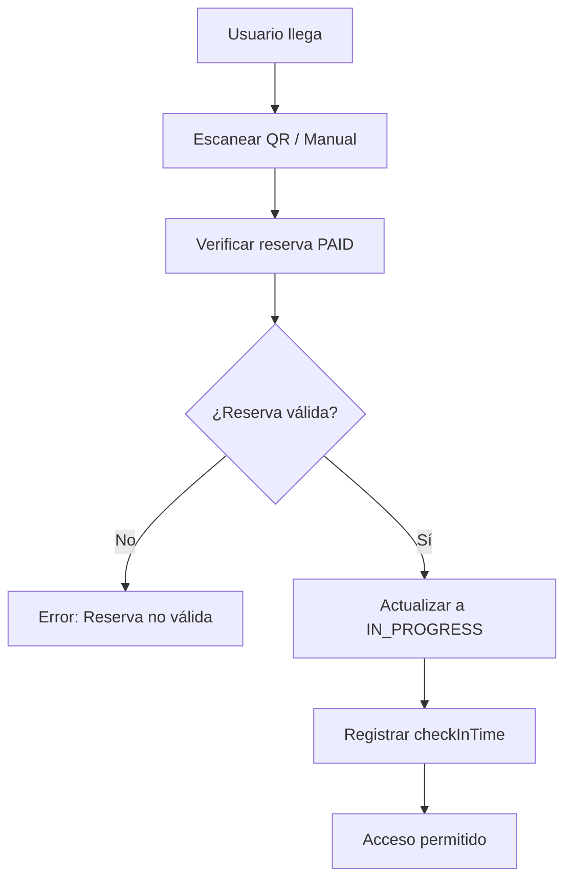
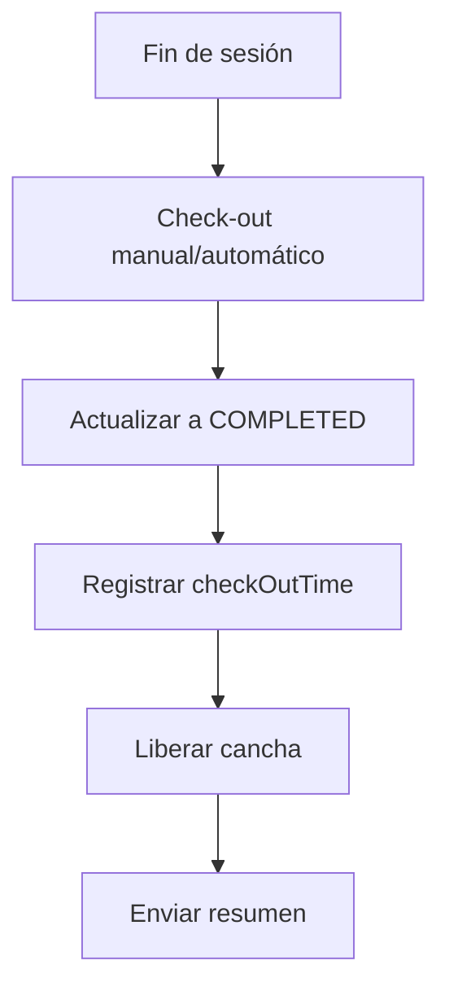

# 📋 Documentación del Flujo de Reservas

## 🔄 Estados de las Reservas

### Estados Principales

| Estado | Descripción | Duración | Acciones Permitidas |
|--------|-------------|----------|--------------------|
| `PENDING` | Reserva creada, esperando pago | **15 minutos** | Pagar, Cancelar |
| `PAID` | Reserva pagada y confirmada | Hasta inicio | Cancelar (con política), Check-in |
| `IN_PROGRESS` | Usuario ha hecho check-in | Durante la sesión | Check-out |
| `COMPLETED` | Sesión finalizada exitosamente | Permanente | Ver historial |
| `CANCELLED` | Reserva cancelada | Permanente | - |
| `NO_SHOW` | Usuario no se presentó | Permanente | - |

---

## 🚀 Flujo Completo de Reservas

### 1. **Creación de Reserva** (`PENDING`)

```mermaid
graph TD
    A[Usuario selecciona horario] --> B[Verificar disponibilidad]
    B --> C{¿Horario disponible?}
    C -->|No| D[Error: "Horario no disponible"]
    C -->|Sí| E[Verificar conflictos usuario]
    E --> F{¿Usuario tiene conflicto?}
    F -->|Sí| G[Error: "Usuario ya tiene reserva"]
    F -->|No| H[Crear reserva PENDING]
    H --> I[⏰ Timer 15 minutos iniciado]
```

**Validaciones en `checkAvailability()`:**
- ✅ Cancha existe y está activa
- ✅ No hay reservas conflictivas (`PENDING`, `PAID`, `IN_PROGRESS`)
- ✅ No hay mantenimiento programado

**Validaciones en `checkUserConflict()`:**
- ✅ Usuario no tiene otra reserva en el mismo día
- ✅ No hay solapamiento de horarios

### 2. **Proceso de Pago** (`PENDING` → `PAID`)

```mermaid
graph TD
    A[Reserva PENDING] --> B{Método de pago}
    B -->|Créditos| C[Verificar saldo]
    B -->|Stripe| D[Procesar pago]
    C --> E{¿Saldo suficiente?}
    E -->|No| F[Error: "Créditos insuficientes"]
    E -->|Sí| G[Debitar créditos]
    D --> H{¿Pago exitoso?}
    H -->|No| I[Error de pago]
    H -->|Sí| J[Actualizar a PAID]
    G --> J
    J --> K[Enviar confirmación]
```

### 3. **Limpieza Automática** (Sistema)



### 4. **Check-in** (`PAID` → `IN_PROGRESS`)



### 5. **Check-out** (`IN_PROGRESS` → `COMPLETED`)



---

## ⚙️ Configuraciones del Sistema

### Timeouts y Límites

```env
# Timeout para reservas PENDING (minutos)
PENDING_RESERVATION_TIMEOUT_MINUTES=15

# Timeout para transacciones críticas (segundos)
TRANSACTION_TIMEOUT_SECONDS=15

# Secreto para cron jobs externos
CRON_SECRET=your_secret_here
```

### Cron Jobs Configurados

| Job | Frecuencia | Endpoint | Propósito |
|-----|------------|----------|----------|
| Cleanup PENDING | `*/15 * * * *` | `/api/admin/cron/reservations/cleanup-pending` | Cancelar reservas expiradas |
| Recordatorios | `0 */6 * * *` | `/api/admin/cron/reservations/reminders` | Enviar recordatorios |

---

## 🔍 Verificación de Disponibilidad

### Lógica de `checkAvailability()`

```typescript
// Estados que bloquean horarios
const BLOCKING_STATUSES = ['PENDING', 'PAID', 'IN_PROGRESS'];

// Verificación de conflictos
const conflictingReservations = await tx.reservation.findMany({
  where: {
    courtId,
    status: { in: BLOCKING_STATUSES },
    OR: [
      {
        startTime: { lt: endTime },
        endTime: { gt: startTime },
      },
    ],
  },
});
```

**⚠️ Problema Identificado y Solucionado:**
- Las reservas `PENDING` bloqueaban horarios indefinidamente
- **Solución:** Cron job automático cada 15 minutos
- **Resultado:** Limpieza automática de reservas expiradas

---

## 🛠️ Herramientas de Debug

### Endpoints de Desarrollo

| Endpoint | Método | Propósito |
|----------|--------|----------|
| `/api/debug/pending-reservations` | GET | Ver reservas PENDING actuales |
| `/api/debug/cleanup-pending` | GET | Preview de limpieza |
| `/api/debug/cleanup-pending` | POST | Ejecutar limpieza manual |

### Scripts de Utilidad

```bash
# Verificar reservas PENDING
node check-pending-reservations.js

# Listar todas las reservas
node list-all-reservations.js

# Verificar servicios
node check-services.js
```

---

## 📊 Métricas y Monitoreo

### Indicadores Clave

- **Reservas PENDING expiradas por día**
- **Tiempo promedio de pago**
- **Tasa de no-show**
- **Utilización de canchas por horario**

### Logs Importantes

```bash
# Creación de reservas
🔍 [RESERVATION-CREATE] Iniciando validaciones...

# Limpieza automática
🧹 [CRON] Iniciando limpieza automática...
✅ [CRON] Cancelada reserva X (Y min de antigüedad)

# Errores comunes
❌ Horario no disponible
❌ Usuario ya tiene reserva
❌ Créditos insuficientes
```

---

## 🔐 Seguridad y Validaciones

### Validaciones de Entrada

- **Zod schemas** para validación de tipos
- **Middleware de autenticación** para endpoints protegidos
- **Rate limiting** para prevenir spam
- **Sanitización** de inputs del usuario

### Transacciones Atómicas

```typescript
// Todas las operaciones críticas usan transacciones
await db.$transaction(async (tx) => {
  // Verificaciones
  await this.checkAvailability(tx, {...});
  await this.checkUserConflict(tx, {...});
  
  // Creación
  const reservation = await tx.reservation.create({...});
  
  // Eventos
  await tx.outboxEvent.create({...});
}, {
  timeout: 15000 // 15 segundos
});
```

---

## 🚨 Manejo de Errores

### Errores Comunes y Soluciones

| Error | Causa | Solución |
|-------|-------|----------|
| "Horario no disponible" | Reserva PENDING bloqueando | ✅ **Solucionado con cron job** |
| "Usuario ya tiene reserva" | Conflicto de horarios | Verificar disponibilidad |
| "Créditos insuficientes" | Saldo insuficiente | Recargar créditos |
| "Cancha en mantenimiento" | Mantenimiento programado | Seleccionar otro horario |

### Recuperación de Errores

- **Reintentos automáticos** para fallos temporales
- **Rollback de transacciones** en caso de error
- **Notificaciones** a administradores para errores críticos
- **Logs detallados** para debugging

---

## 📈 Optimizaciones Implementadas

### Performance

- ✅ **Índices de base de datos** en campos críticos
- ✅ **Transacciones optimizadas** con timeout
- ✅ **Caching** de configuraciones
- ✅ **Paginación** en listados

### Escalabilidad

- ✅ **Procesamiento asíncrono** con outbox pattern
- ✅ **Separación de responsabilidades** en servicios
- ✅ **Configuración por variables de entorno**
- ✅ **Monitoreo automático** con health checks

---

*Documentación actualizada: Agosto 2025*
*Problema de reservas PENDING: ✅ **RESUELTO***